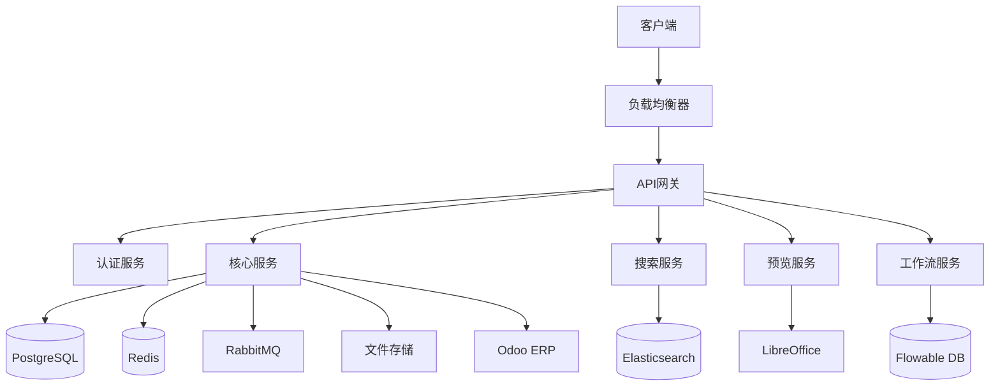
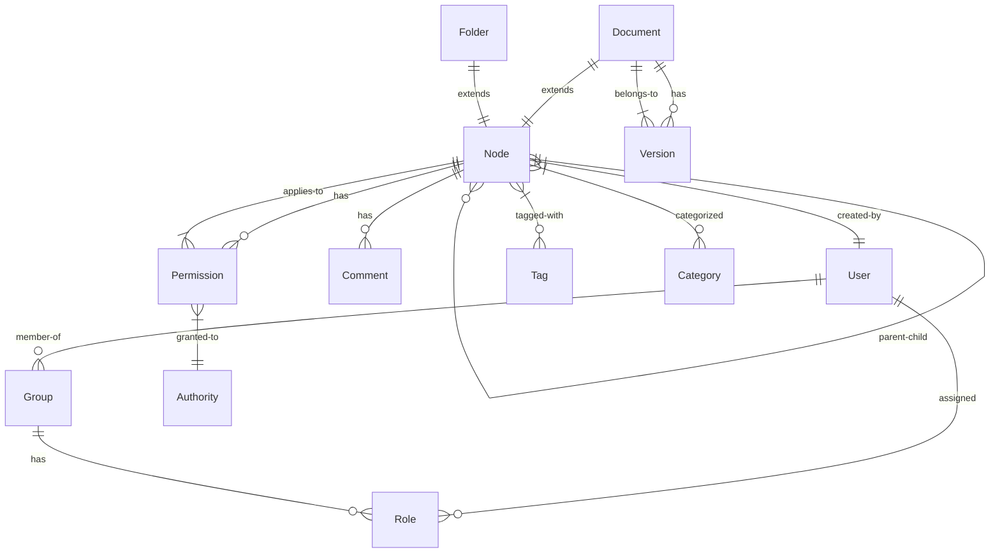
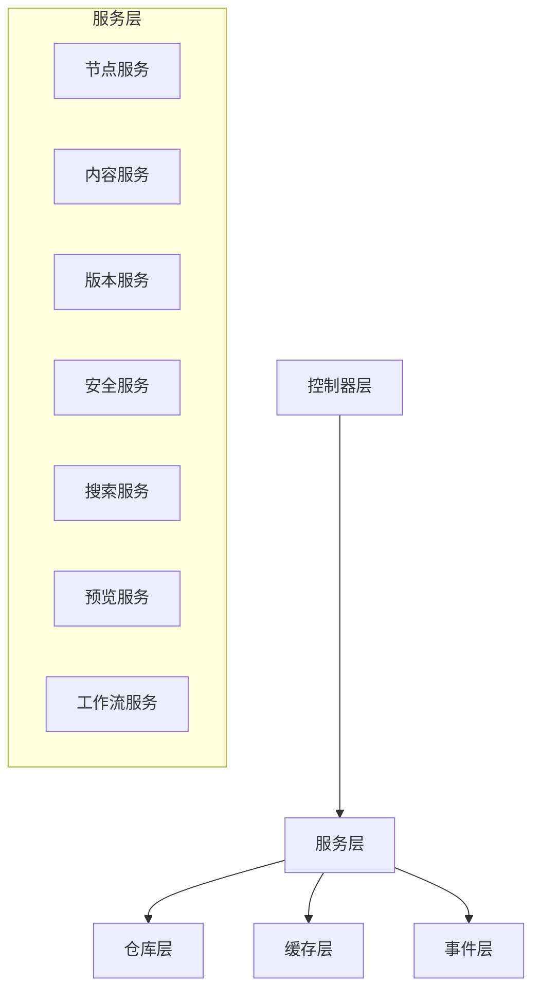
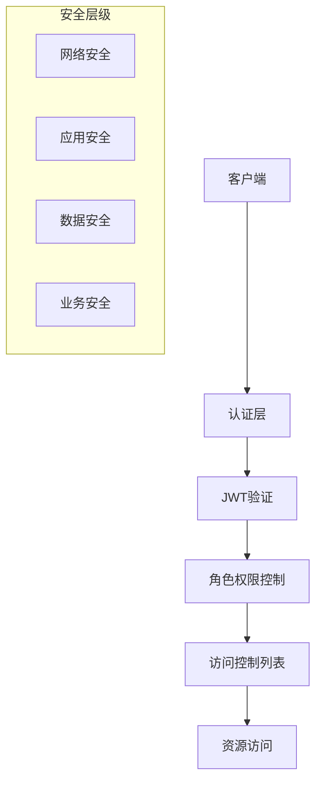
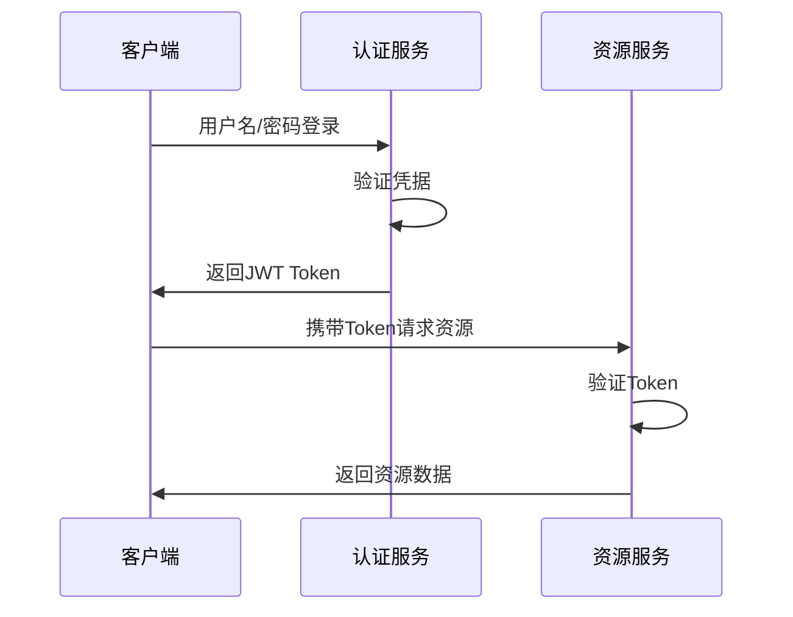
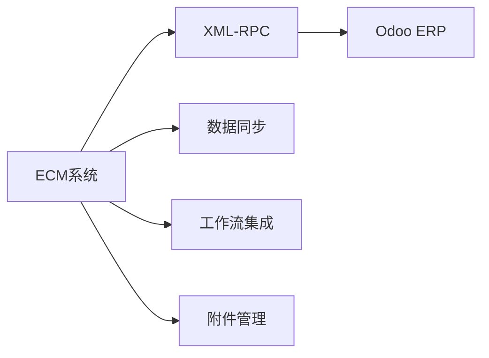
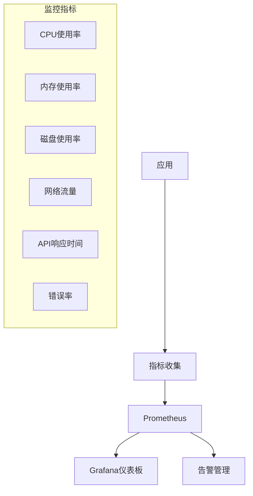

# Athena ECM 系统设计文档

## 目录
- [系统概述](#系统概述)
- [架构设计](#架构设计)
- [数据模型设计](#数据模型设计)
- [服务层设计](#服务层设计)
- [API设计](#api设计)
- [安全设计](#安全设计)
- [集成设计](#集成设计)
- [性能设计](#性能设计)

## 系统概述

### 系统简介
Athena ECM是一个企业级内容管理系统，采用现代化的微服务架构，提供完整的文档生命周期管理、工作流自动化和企业集成能力。

### 核心特性
- 📁 **文档管理**: 支持文件上传、版本控制、权限管理
- 🔍 **全文搜索**: 基于Elasticsearch的智能搜索
- 📋 **工作流引擎**: Flowable BPMN 2.0工作流
- 🖼️ **文件预览**: 支持Office、PDF、CAD文件预览
- 🔄 **格式转换**: 多种文件格式互转
- 🔗 **企业集成**: Odoo ERP集成、Alfresco兼容
- 📊 **监控审计**: 完整的审计日志和监控

### 技术栈
| 组件 | 技术选型 | 版本 | 用途 |
|------|----------|------|------|
| 后端框架 | Spring Boot | 3.2.0 | REST API和业务逻辑 |
| 前端框架 | React + TypeScript | 18+ | 用户界面 |
| 数据库 | PostgreSQL | 15 | 主数据存储 |
| 搜索引擎 | Elasticsearch | 8.11 | 全文搜索 |
| 缓存 | Redis | 7 | 缓存和会话 |
| 消息队列 | RabbitMQ | 3.12 | 事件消息 |
| 工作流 | Flowable | 7.0 | BPM引擎 |
| 容器化 | Docker | Latest | 服务容器化 |

## 架构设计

### 整体架构



### 分层架构

```
┌─────────────────────────────────────────┐
│              表现层 (Web/API)              │
├─────────────────────────────────────────┤
│               业务逻辑层                   │
│  ┌─────────────┬─────────────────────────┐│
│  │ 服务层      │ 事件层                   ││
│  │ - NodeService│ - Event Publishing      ││
│  │ - ContentSvc │ - Async Processing      ││
│  │ - SecuritySvc│ - Audit Logging         ││
│  └─────────────┴─────────────────────────┘│
├─────────────────────────────────────────┤
│               数据访问层                   │
│  ┌─────────────┬─────────────────────────┐│
│  │ Repository  │ 缓存层                   ││
│  │ - JPA       │ - Redis Cache           ││
│  │ - Elasticsearch│ - Session Store      ││
│  └─────────────┴─────────────────────────┘│
├─────────────────────────────────────────┤
│                基础设施层                  │
│  Database | Search | Cache | MQ | Storage │
└─────────────────────────────────────────┘
```

### 微服务架构

#### 核心服务模块
1. **ECM核心服务** - 文档和文件夹管理
2. **内容服务** - 文件存储和检索
3. **搜索服务** - 全文搜索和索引
4. **预览服务** - 文件预览和转换
5. **工作流服务** - 业务流程管理
6. **安全服务** - 认证和授权
7. **集成服务** - 外部系统集成

#### 服务间通信
- **同步通信**: REST API (HTTP/HTTPS)
- **异步通信**: RabbitMQ消息队列
- **数据共享**: 共享数据库 + 事件驱动

## 数据模型设计

### 核心实体关系图



### 主要实体设计

#### Node (节点基类)
```java
@Entity
@Inheritance(strategy = InheritanceType.JOINED)
public abstract class Node extends BaseEntity {
    private String name;           // 节点名称
    private String description;    // 描述
    private String path;          // 节点路径
    private Node parent;          // 父节点
    private Set<Node> children;   // 子节点
    private Map<String, Object> properties;  // 自定义属性(JSONB)
    private Map<String, Object> metadata;    // 元数据(JSONB)
    private boolean locked;       // 是否锁定
    private NodeStatus status;    // 节点状态
    // ... 其他字段
}
```

#### Document (文档)
```java
@Entity
public class Document extends Node {
    private String contentId;      // 内容ID
    private String mimeType;       // MIME类型
    private Long fileSize;         // 文件大小
    private String contentHash;    // 内容哈希
    private Version currentVersion; // 当前版本
    private List<Version> versions; // 版本历史
    private String checkoutUser;    // 检出用户
    private boolean previewAvailable; // 是否可预览
    // ... 其他字段
}
```

#### Version (版本)
```java
@Entity
public class Version extends BaseEntity {
    private Document document;     // 所属文档
    private Integer versionNumber; // 版本号
    private String versionLabel;   // 版本标签
    private String contentId;      // 内容ID
    private String comment;        // 版本注释
    private VersionStatus status;  // 版本状态
    // ... 其他字段
}
```

#### Permission (权限)
```java
@Entity
public class Permission extends BaseEntity {
    private Node node;             // 关联节点
    private String authority;      // 权限主体
    private AuthorityType authorityType; // 主体类型
    private PermissionType permission;   // 权限类型
    private boolean allowed;       // 是否允许
    private LocalDateTime expiryDate;    // 过期时间
    // ... 其他字段
}
```

### 数据库设计原则

1. **规范化设计**: 遵循3NF范式，避免数据冗余
2. **JSONB支持**: 利用PostgreSQL JSONB存储灵活属性
3. **索引优化**: 为查询频繁的字段建立索引
4. **软删除**: 使用软删除保留数据完整性
5. **审计字段**: 所有实体包含创建和修改信息

## 服务层设计

### 服务架构



### 核心服务设计

#### NodeService (节点服务)
**职责**: 文件和文件夹的CRUD操作
```java
@Service
public class NodeService {
    // 创建节点
    Node createNode(Node node, UUID parentId);
    
    // 获取节点
    Node getNode(UUID nodeId);
    
    // 移动节点
    Node moveNode(UUID nodeId, UUID targetParentId);
    
    // 复制节点
    Node copyNode(UUID nodeId, UUID targetParentId, boolean deep);
    
    // 搜索节点
    List<Node> searchNodes(String query, SearchFilters filters);
}
```

#### ContentService (内容服务)
**职责**: 文件内容存储和检索
```java
@Service
public class ContentService {
    // 存储内容
    String storeContent(InputStream inputStream, String filename);
    
    // 获取内容
    InputStream getContent(String contentId);
    
    // 删除内容
    void deleteContent(String contentId);
    
    // 提取元数据
    Map<String, Object> extractMetadata(String contentId);
}
```

#### SecurityService (安全服务)
**职责**: 权限控制和安全管理
```java
@Service
public class SecurityService {
    // 检查权限
    boolean hasPermission(Node node, PermissionType permissionType);
    
    // 设置权限
    void setPermission(Node node, String authority, PermissionType permission, boolean allowed);
    
    // 获取当前用户
    User getCurrentUser();
    
    // 获取用户权限
    Set<String> getUserAuthorities(String username);
}
```

### 事件驱动设计

#### 事件发布
```java
@Component
public class NodeEventPublisher {
    @Autowired
    private ApplicationEventPublisher eventPublisher;
    
    public void publishNodeCreated(Node node) {
        eventPublisher.publishEvent(new NodeCreatedEvent(node));
    }
}
```

#### 事件监听
```java
@Component
public class NodeEventListener {
    @Async
    @EventListener
    public void handleNodeCreated(NodeCreatedEvent event) {
        // 审计日志
        auditService.logNodeCreated(event.getNode());
        
        // 搜索索引
        searchIndexService.indexNode(event.getNode());
        
        // 发送通知
        notificationService.notifyNodeCreated(event.getNode());
    }
}
```

## API设计

### RESTful API 设计原则

1. **资源导向**: 以资源为中心的URL设计
2. **HTTP动词**: 正确使用GET、POST、PUT、DELETE
3. **状态码**: 合理使用HTTP状态码
4. **版本控制**: API版本管理 `/api/v1/`
5. **错误处理**: 统一的错误响应格式

### API架构

```
/api/v1/
├── nodes/                    # 节点管理
│   ├── GET    /              # 获取节点列表
│   ├── POST   /              # 创建节点
│   ├── GET    /{id}          # 获取节点
│   ├── PUT    /{id}          # 更新节点
│   ├── DELETE /{id}          # 删除节点
│   ├── POST   /{id}/move     # 移动节点
│   └── POST   /{id}/copy     # 复制节点
├── documents/                # 文档管理
│   ├── POST   /upload        # 上传文档
│   ├── GET    /{id}/download # 下载文档
│   ├── GET    /{id}/preview  # 预览文档
│   ├── POST   /{id}/convert  # 转换文档
│   └── GET    /{id}/versions # 版本历史
├── search/                   # 搜索服务
│   ├── POST   /              # 搜索文档
│   └── GET    /suggestions   # 搜索建议
├── workflows/                # 工作流管理
│   ├── GET    /definitions   # 流程定义
│   ├── POST   /instances     # 启动流程
│   └── GET    /tasks         # 任务列表
└── security/                 # 安全管理
    ├── GET    /permissions   # 权限查询
    ├── POST   /permissions   # 设置权限
    └── GET    /users/current # 当前用户
```

### API响应格式

#### 成功响应
```json
{
  "success": true,
  "data": {
    "id": "uuid",
    "name": "document.pdf",
    "type": "DOCUMENT"
  },
  "message": "操作成功"
}
```

#### 错误响应
```json
{
  "success": false,
  "error": {
    "code": "DOCUMENT_NOT_FOUND",
    "message": "文档未找到",
    "details": "Document with id 'uuid' does not exist"
  },
  "timestamp": "2024-01-01T10:00:00Z"
}
```

## 安全设计

### 安全架构



### 认证与授权

#### JWT认证流程


#### 权限模型
```
用户(User) ←→ 角色(Role) ←→ 权限(Permission)
     ↑
    组织(Group)
```

### 数据安全

1. **传输安全**: HTTPS加密传输
2. **存储安全**: 数据库加密存储
3. **访问控制**: 细粒度权限控制
4. **审计日志**: 完整操作记录
5. **备份策略**: 定期数据备份

## 集成设计

### Odoo ERP集成

#### 集成架构


#### 集成功能
1. **文档附件**: ECM文档附加到Odoo记录
2. **元数据同步**: 双向数据同步
3. **工作流集成**: ECM工作流触发Odoo流程
4. **权限映射**: 权限体系映射

### Alfresco兼容层

#### 兼容性设计
```java
// Alfresco API兼容接口
public interface AlfrescoNodeService {
    NodeRef createNode(NodeRef parent, QName nodeType, Map<QName, Serializable> properties);
    Map<QName, Serializable> getProperties(NodeRef nodeRef);
    void setProperties(NodeRef nodeRef, Map<QName, Serializable> properties);
    // ... 其他兼容方法
}
```

## 性能设计

### 性能优化策略

1. **数据库优化**
   - 索引优化
   - 查询优化
   - 连接池配置

2. **缓存策略**
   - Redis缓存热点数据
   - 应用级缓存
   - CDN静态资源缓存

3. **文件存储优化**
   - 内容去重
   - 分级存储
   - 压缩优化

4. **搜索优化**
   - Elasticsearch集群
   - 索引分片
   - 查询优化

### 监控与告警



### 扩展性设计

1. **水平扩展**: 支持多实例部署
2. **服务拆分**: 微服务架构支持
3. **数据库扩展**: 读写分离、分库分表
4. **存储扩展**: 支持云存储、分布式存储

---

**版本**: 1.0  
**更新时间**: 2024年1月  
**维护者**: Athena ECM开发团队