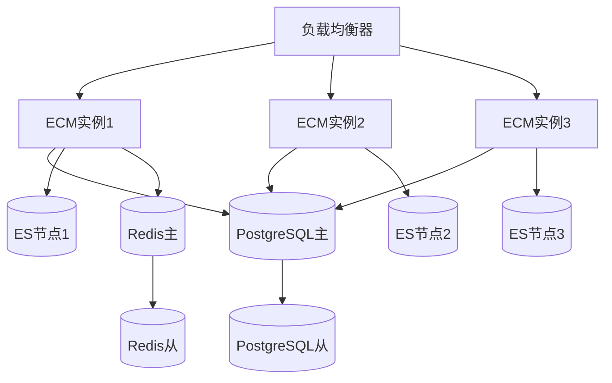

# Athena ECM 安装部署指南

## 目录
- [系统要求](#系统要求)
- [快速安装](#快速安装)
- [详细安装步骤](#详细安装步骤)
- [配置说明](#配置说明)
- [生产环境部署](#生产环境部署)
- [故障排除](#故障排除)
- [性能调优](#性能调优)

## 系统要求

### 硬件要求

#### 最小配置（开发/测试环境）
- **CPU**: 2核心 2.0GHz
- **内存**: 8GB RAM
- **存储**: 50GB 可用空间
- **网络**: 1Gbps

#### 推荐配置（生产环境）
- **CPU**: 8核心 2.4GHz
- **内存**: 32GB RAM
- **存储**: 500GB SSD (系统) + 2TB HDD (数据)
- **网络**: 10Gbps

#### 高可用配置（企业环境）
- **CPU**: 16核心 3.0GHz
- **内存**: 64GB RAM
- **存储**: 1TB NVMe SSD (系统) + 10TB 企业级存储
- **网络**: 10Gbps 双网卡
- **备份**: 独立备份存储

### 软件要求

#### 必需软件
- **操作系统**: Linux (Ubuntu 20.04+/CentOS 8+/RHEL 8+)
- **Docker**: 20.10+ 
- **Docker Compose**: 2.0+
- **Git**: 2.0+

#### 可选软件（开发环境）
- **Java**: OpenJDK 17+
- **Node.js**: 18.0+
- **Maven**: 3.9+
- **npm**: 8.0+

### 端口要求
| 服务 | 端口 | 协议 | 说明 |
|------|------|------|------|
| Nginx | 80, 443 | HTTP/HTTPS | Web服务器 |
| ECM Core | 7700 | HTTP | 后端API（宿主机端口，可在 `.env` 中配置） |
| Frontend | 5500 | HTTP | 前端应用（宿主机端口，可在 `.env` 中配置） |
| Keycloak | 8180 | HTTP | 统一认证（OIDC） |
| PostgreSQL | 5432 | TCP | 主数据库 |
| Elasticsearch | 9200, 9300 | HTTP/TCP | 搜索引擎 |
| Redis | 6390 | TCP | 缓存服务（宿主机端口映射到容器 6379） |
| RabbitMQ | 5672, 15672 | AMQP/HTTP | 消息队列 |
| MinIO | 9205, 9206 | HTTP | 对象存储（API/Console） |
| Grafana | 3001 | HTTP | 监控面板 |
| Prometheus | 9090 | HTTP | 指标收集 |

## 快速安装

### 一键安装脚本

```bash
#!/bin/bash
# Athena ECM 一键安装脚本

echo "=== Athena ECM 安装开始 ==="

# 1. 检查系统要求
echo "检查系统要求..."
if ! command -v docker &> /dev/null; then
    echo "错误: 请先安装 Docker"
    exit 1
fi

if ! command -v docker-compose &> /dev/null; then
    echo "错误: 请先安装 Docker Compose"
    exit 1
fi

# 2. 克隆代码
echo "克隆代码库..."
git clone https://github.com/your-org/athena-ecm.git
cd athena-ecm

# 3. 配置环境变量
echo "配置环境变量..."
cp .env.example .env

# 4. 创建存储目录
echo "创建存储目录..."
mkdir -p storage/{content,temp,backup}
mkdir -p logs
chmod 755 storage logs

# 5. 启动服务
echo "启动服务..."
docker-compose up -d

# 6. 等待服务启动
echo "等待服务启动..."
sleep 60

# 7. 检查服务状态
echo "检查服务状态..."
docker-compose ps

echo "=== 安装完成 ==="
echo "访问地址: http://localhost"
echo "API文档: http://localhost:7700/swagger-ui.html"
echo "监控面板: http://localhost:3001 (admin/admin_password)"
echo ""
echo "默认登录账号:"
echo "用户名: admin"
echo "密码: admin"
```

### Docker Compose 快速启动

```bash
# 1. 下载代码
git clone https://github.com/your-org/athena-ecm.git
cd athena-ecm

# 2. 配置环境变量
cp .env.example .env
# 编辑 .env 文件，修改密码等配置

# 3. 启动所有服务
docker-compose up -d

# 4. 查看服务状态
docker-compose ps

# 5. 查看日志
docker-compose logs -f ecm-core
```

## 详细安装步骤

### 步骤1: 环境准备

#### 1.1 安装Docker和Docker Compose

##### Ubuntu/Debian
```bash
# 更新包索引
sudo apt update

# 安装Docker
curl -fsSL https://get.docker.com -o get-docker.sh
sudo sh get-docker.sh

# 安装Docker Compose
sudo curl -L "https://github.com/docker/compose/releases/latest/download/docker-compose-$(uname -s)-$(uname -m)" -o /usr/local/bin/docker-compose
sudo chmod +x /usr/local/bin/docker-compose

# 添加当前用户到docker组
sudo usermod -aG docker $USER
newgrp docker
```

##### CentOS/RHEL
```bash
# 安装Docker
sudo yum install -y yum-utils
sudo yum-config-manager --add-repo https://download.docker.com/linux/centos/docker-ce.repo
sudo yum install -y docker-ce docker-ce-cli containerd.io

# 启动Docker
sudo systemctl start docker
sudo systemctl enable docker

# 安装Docker Compose
sudo curl -L "https://github.com/docker/compose/releases/latest/download/docker-compose-$(uname -s)-$(uname -m)" -o /usr/local/bin/docker-compose
sudo chmod +x /usr/local/bin/docker-compose
```

#### 1.2 防火墙配置

```bash
# Ubuntu/Debian (UFW)
sudo ufw allow 80/tcp
sudo ufw allow 443/tcp
sudo ufw allow 8080/tcp
sudo ufw reload

# CentOS/RHEL (firewalld)
sudo firewall-cmd --permanent --add-port=80/tcp
sudo firewall-cmd --permanent --add-port=443/tcp
sudo firewall-cmd --permanent --add-port=8080/tcp
sudo firewall-cmd --reload
```

### 步骤2: 下载和配置

#### 2.1 获取源码
```bash
# 克隆代码库
git clone https://github.com/your-org/athena-ecm.git
cd athena-ecm

# 检查目录结构
ls -la
```

#### 2.2 配置环境变量
```bash
# 复制环境变量模板
cp .env.example .env

# 编辑配置文件
nano .env
```

**重要配置项说明**:
```bash
# 数据库配置
POSTGRES_DB=ecm_db
POSTGRES_USER=ecm_user
POSTGRES_PASSWORD=your_secure_password

# Redis配置
REDIS_PASSWORD=your_redis_password

# JWT密钥（请使用强密钥）
JWT_SECRET=your_jwt_secret_key_here

# Odoo集成配置
ODOO_API_KEY=your_odoo_api_key

# 管理员密码
GRAFANA_ADMIN_PASSWORD=your_grafana_password
```

#### 2.3 创建存储目录
```bash
# 创建数据存储目录
mkdir -p storage/{content,temp,backup}
mkdir -p logs
mkdir -p ssl

# 设置权限
chmod 755 storage logs ssl
sudo chown -R 1000:1000 storage logs

# 如果使用 Docker 命名卷，容器内目录可能保持原属主。
# 新版 ecm-core 启动时会自动修复 /var/ecm/content 权限，
# 但旧卷仍可能需要一次性修复：
# docker exec -u 0 athena-ecm-core-1 chown -R app:app /var/ecm/content
```

### 步骤3: SSL证书配置 (生产环境)

#### 3.1 使用Let's Encrypt (推荐)
```bash
# 安装certbot
sudo apt install certbot

# 获取SSL证书
sudo certbot certonly --standalone -d your-domain.com

# 复制证书到项目目录
sudo cp /etc/letsencrypt/live/your-domain.com/fullchain.pem ./ssl/cert.pem
sudo cp /etc/letsencrypt/live/your-domain.com/privkey.pem ./ssl/key.pem
sudo chmod 644 ssl/cert.pem
sudo chmod 600 ssl/key.pem
```

#### 3.2 使用自签名证书 (测试环境)
```bash
# 生成自签名证书
openssl req -x509 -nodes -days 365 -newkey rsa:2048 \
  -keyout ssl/key.pem \
  -out ssl/cert.pem \
  -subj "/C=CN/ST=State/L=City/O=Organization/CN=localhost"
```

### 步骤4: 构建和启动服务

#### 4.1 构建镜像
```bash
# 构建所有服务镜像
docker-compose build

# 或构建特定服务
docker-compose build ecm-core
docker-compose build ecm-frontend
```

#### 4.2 启动服务
```bash
# 启动所有服务
docker-compose up -d

# 查看启动状态
docker-compose ps

# 查看服务日志
docker-compose logs -f ecm-core
```

#### 4.3 初始化数据
```bash
# 等待数据库启动
sleep 30

# 检查数据库连接
docker-compose exec postgres psql -U ecm_user -d ecm_db -c "SELECT version();"

# 查看应用日志确认启动成功
docker-compose logs ecm-core | grep "Started EcmCoreApplication"
```

### 步骤5: 验证安装

#### 5.1 服务健康检查
```bash
# 检查所有服务状态
docker-compose ps

# 检查服务健康状态
curl http://localhost:7700/actuator/health

# 检查前端访问
curl http://localhost:5500

# 检查API文档
curl http://localhost:7700/swagger-ui.html
```

#### 5.2 功能验证
```bash
# 测试API端点
curl -X GET http://localhost:7700/api/v1/nodes \
  -H "Content-Type: application/json"

# 测试搜索功能
curl -X POST http://localhost:9200/ecm_documents/_search \
  -H "Content-Type: application/json" \
  -d '{"query": {"match_all": {}}}'
```

## 配置说明

### 应用配置

#### application.yml 主要配置项
```yaml
# 数据库配置
spring:
  datasource:
    url: jdbc:postgresql://postgres:5432/ecm_db
    username: ${POSTGRES_USER}
    password: ${POSTGRES_PASSWORD}
    
# Elasticsearch配置
  elasticsearch:
    uris: http://elasticsearch:9200
    
# 文件存储配置
ecm:
  storage:
    root-path: /var/ecm/content
    temp-path: /var/ecm/temp
    
# 预览配置
  preview:
    max-pages: 50
    thumbnail:
      width: 200
      height: 200
```

### 数据库配置

#### PostgreSQL 优化配置
```sql
-- 性能优化配置
ALTER SYSTEM SET shared_buffers = '256MB';
ALTER SYSTEM SET effective_cache_size = '1GB';
ALTER SYSTEM SET maintenance_work_mem = '64MB';
ALTER SYSTEM SET checkpoint_completion_target = 0.7;
ALTER SYSTEM SET wal_buffers = '16MB';
ALTER SYSTEM SET default_statistics_target = 100;

-- 重新加载配置
SELECT pg_reload_conf();
```

### Elasticsearch 配置

#### elasticsearch.yml
```yaml
cluster.name: ecm-cluster
node.name: ecm-node-1
network.host: 0.0.0.0
discovery.type: single-node

# JVM 内存设置
bootstrap.memory_lock: true

# 索引设置
index.number_of_shards: 1
index.number_of_replicas: 0
```

### Nginx 配置

#### 性能优化配置
```nginx
# nginx.conf
worker_processes auto;
worker_connections 1024;

# 启用gzip压缩
gzip on;
gzip_vary on;
gzip_min_length 1024;
gzip_comp_level 6;

# 文件上传大小限制
client_max_body_size 500M;

# 缓存配置
location ~* \.(css|js|png|jpg|jpeg|gif|ico|svg)$ {
    expires 1y;
    add_header Cache-Control "public, immutable";
}
```

## 生产环境部署

### 高可用架构



### 生产环境清单

#### 1. 硬件资源清单
```yaml
应用服务器:
  - 数量: 3台
  - 规格: 16核CPU, 32GB内存, 500GB SSD
  
数据库服务器:
  - 数量: 2台 (主从)
  - 规格: 8核CPU, 64GB内存, 2TB SSD
  
搜索服务器:
  - 数量: 3台
  - 规格: 8核CPU, 16GB内存, 1TB SSD
  
存储服务器:
  - 数量: 1台
  - 规格: 4核CPU, 8GB内存, 10TB企业级存储
```

#### 2. 网络配置
```bash
# 防火墙规则
# 只允许必要端口对外开放
iptables -A INPUT -p tcp --dport 80 -j ACCEPT
iptables -A INPUT -p tcp --dport 443 -j ACCEPT
iptables -A INPUT -p tcp --dport 22 -j ACCEPT

# 内网服务端口只允许内部访问
iptables -A INPUT -s 10.0.0.0/8 -p tcp --dport 5432 -j ACCEPT
iptables -A INPUT -s 10.0.0.0/8 -p tcp --dport 9200 -j ACCEPT
```

#### 3. 监控配置
```yaml
# docker-compose.prod.yml
version: '3.8'
services:
  prometheus:
    image: prom/prometheus:latest
    volumes:
      - ./monitoring/prometheus.yml:/etc/prometheus/prometheus.yml
      - prometheus_data:/prometheus
    command:
      - '--config.file=/etc/prometheus/prometheus.yml'
      - '--storage.tsdb.retention.time=30d'
      - '--web.enable-lifecycle'
    
  grafana:
    image: grafana/grafana:latest
    environment:
      - GF_SECURITY_ADMIN_PASSWORD=${GRAFANA_ADMIN_PASSWORD}
    volumes:
      - grafana_data:/var/lib/grafana
      - ./monitoring/grafana:/etc/grafana/provisioning
```

#### 4. 备份策略
```bash
#!/bin/bash
# backup.sh - 自动备份脚本

# 数据库备份
docker-compose exec -T postgres pg_dump -U ecm_user ecm_db | gzip > backup/db_$(date +%Y%m%d_%H%M%S).sql.gz

# 文件存储备份
tar -czf backup/storage_$(date +%Y%m%d_%H%M%S).tar.gz storage/

# 配置文件备份
tar -czf backup/config_$(date +%Y%m%d_%H%M%S).tar.gz .env docker-compose.yml nginx/

# 清理旧备份 (保留30天)
find backup/ -name "*.gz" -mtime +30 -delete

# 上传到远程存储
# rsync -av backup/ user@backup-server:/backup/athena-ecm/
```

### 安全加固

#### 1. 系统安全
```bash
# 更新系统
sudo apt update && sudo apt upgrade -y

# 配置自动安全更新
sudo apt install unattended-upgrades
sudo dpkg-reconfigure unattended-upgrades

# 配置fail2ban
sudo apt install fail2ban
sudo cp /etc/fail2ban/jail.conf /etc/fail2ban/jail.local
```

#### 2. 应用安全
```yaml
# 安全配置项
ecm:
  security:
    jwt:
      secret: ${JWT_SECRET}  # 使用强密钥
      expiration: 3600000    # 1小时过期
    cors:
      allowed-origins: "https://your-domain.com"
      allowed-methods: "GET,POST,PUT,DELETE"
    rate-limit:
      enabled: true
      requests-per-minute: 100
```

#### 3. 数据库安全
```sql
-- 创建只读用户
CREATE USER ecm_readonly WITH PASSWORD 'readonly_password';
GRANT CONNECT ON DATABASE ecm_db TO ecm_readonly;
GRANT USAGE ON SCHEMA public TO ecm_readonly;
GRANT SELECT ON ALL TABLES IN SCHEMA public TO ecm_readonly;

-- 配置SSL连接
ALTER SYSTEM SET ssl = on;
ALTER SYSTEM SET ssl_cert_file = '/var/lib/postgresql/server.crt';
ALTER SYSTEM SET ssl_key_file = '/var/lib/postgresql/server.key';
```

## 故障排除

### 常见问题

#### 1. 服务启动失败
```bash
# 检查Docker服务状态
sudo systemctl status docker

# 检查端口占用
netstat -tlnp | grep :8080

# 查看容器日志
docker-compose logs ecm-core

# 重启服务
docker-compose restart ecm-core
```

#### 2. 数据库连接问题
```bash
# 检查数据库容器状态
docker-compose ps postgres

# 连接数据库测试
docker-compose exec postgres psql -U ecm_user -d ecm_db

# 检查数据库日志
docker-compose logs postgres
```

#### 3. 搜索功能异常
```bash
# 检查Elasticsearch状态
curl http://localhost:9200/_cluster/health

# 查看索引信息
curl http://localhost:9200/_cat/indices

# 重建索引
curl -X DELETE http://localhost:9200/ecm_documents
curl -X PUT http://localhost:9200/ecm_documents
```

#### 4. 文件上传失败
```bash
# 检查存储目录权限
ls -la storage/

# 检查磁盘空间
df -h

# 检查Nginx上传限制
grep client_max_body_size nginx/nginx.conf
```

### 日志分析

#### 应用日志位置
```bash
# 应用日志
docker-compose logs ecm-core

# Nginx访问日志
docker-compose exec nginx tail -f /var/log/nginx/access.log

# 系统日志
tail -f logs/ecm-core.log
```

#### 错误码说明
| 错误码 | 说明 | 解决方案 |
|--------|------|----------|
| 500 | 服务器内部错误 | 检查应用日志 |
| 404 | 资源未找到 | 检查API路径 |
| 403 | 权限不足 | 检查用户权限 |
| 401 | 认证失败 | 检查JWT Token |

### 性能问题排查

#### 系统性能监控
```bash
# CPU使用率
top -p $(docker-compose ps -q)

# 内存使用情况
docker stats

# 磁盘I/O
iostat -x 1

# 网络连接
netstat -an | grep :8080
```

## 性能调优

### JVM调优

#### ECM Core JVM参数
```dockerfile
# Dockerfile
ENV JAVA_OPTS="-Xms2g -Xmx4g -XX:+UseG1GC -XX:MaxGCPauseMillis=200 -XX:+UnlockExperimentalVMOptions -XX:+UseJVMCICompiler"
```

### 数据库调优

#### PostgreSQL配置优化
```sql
-- 连接数设置
ALTER SYSTEM SET max_connections = 200;

-- 内存设置
ALTER SYSTEM SET shared_buffers = '1GB';
ALTER SYSTEM SET work_mem = '16MB';
ALTER SYSTEM SET maintenance_work_mem = '256MB';

-- WAL设置
ALTER SYSTEM SET wal_buffers = '64MB';
ALTER SYSTEM SET checkpoint_segments = 32;

-- 查询优化
ALTER SYSTEM SET random_page_cost = 1.1;
ALTER SYSTEM SET effective_cache_size = '4GB';
```

### Elasticsearch调优

#### ES JVM配置
```yaml
# docker-compose.yml
environment:
  - "ES_JAVA_OPTS=-Xms2g -Xmx2g"
  - "bootstrap.memory_lock=true"
```

### 缓存优化

#### Redis配置
```conf
# redis.conf
maxmemory 1gb
maxmemory-policy allkeys-lru
save 900 1
save 300 10
save 60 10000
```

---

**版本**: 1.0  
**更新时间**: 2024年1月  
**技术支持**: support@athena-ecm.com
